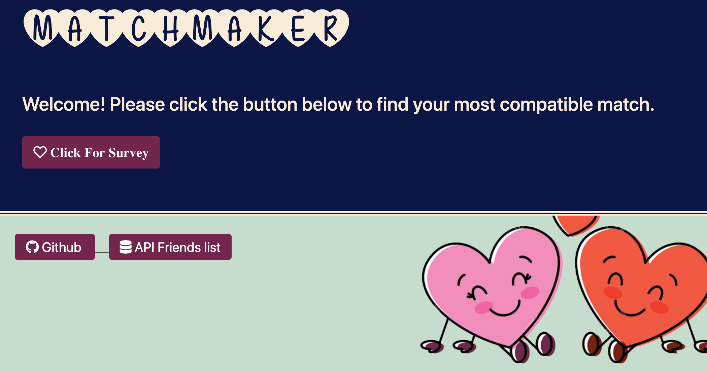
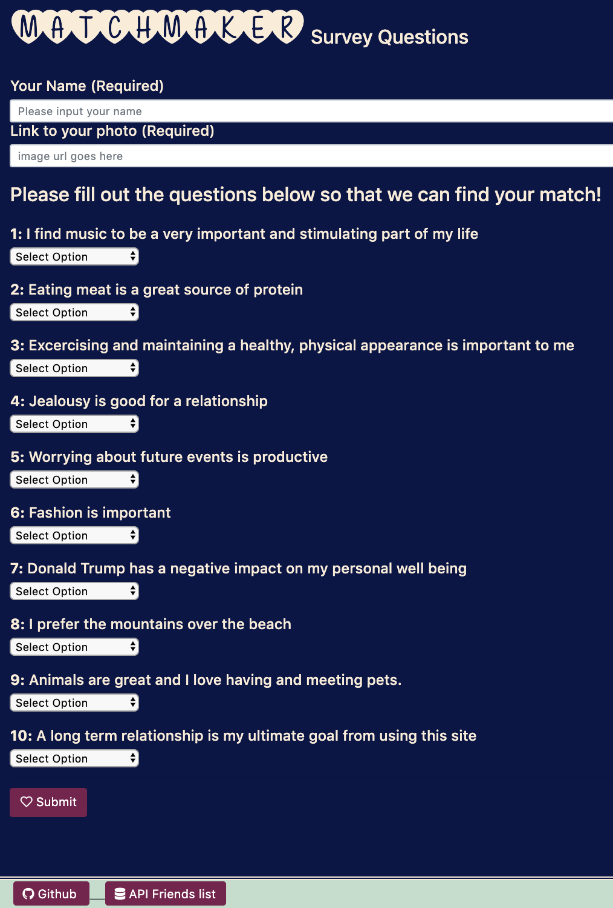

# Welcome to FriendFinder ... I mean MatchMaker.

MatchMaker was designed to find the best romantic match based on the end users response to a survey. After all of the questions are answered the user will submit their responses, at which time the best match will be displayed on the screen.

## How To Use:

- Just click on the icon with the heart and you'll be redirected to the survey page.
  
- Then fill out the survey and submit your answers.
  
- A modal will appear displaying your match.
  

## Technologies Used

- Node
- Express (middleware)
- Javascript / Jquery / html / css
